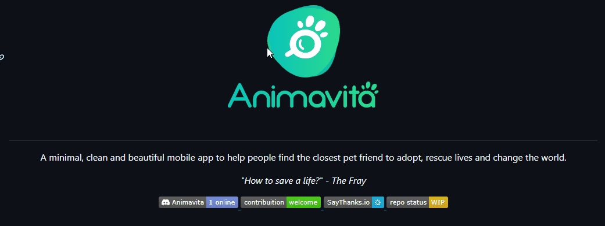

# Projeto com README
Um projeto de teste com arquivo README 🚀

[](https://github.com/animavita/animavita/blob/v2/README.md)

## Tecnologias utilizadas:
- HTML
- CSS
- JS

## Como utilizar:

1 - Clone o Projeto
```
git clone <https://github.com/Henrique-Meregalli/repositorio-com-readme.git>
```
2 - Acesse a pasta do projeto
```
cd-repositorio-com-readme
```